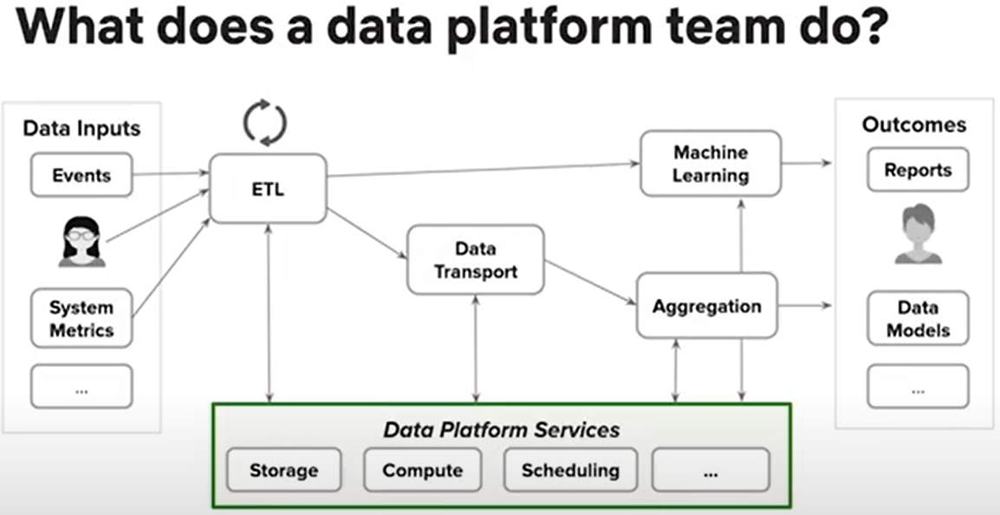
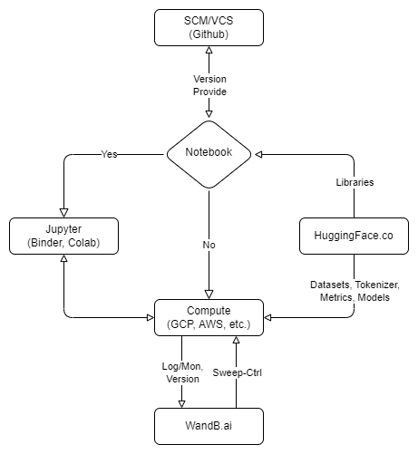
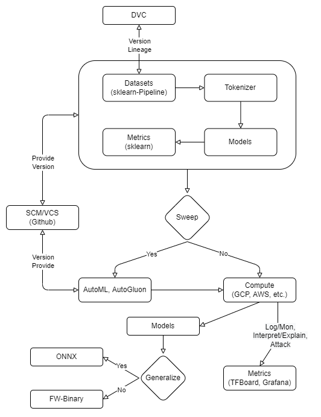
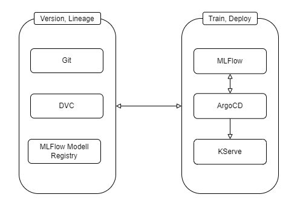

# Pipeline skeleton

[WIP] [DRAFT] to be used for upcoming experiments.

## TOC

* [Purpose](#purpose-)
* [Guidance](#guidance-)
* [Pipelines](#pipelines-)
* [Usage](#usage-)
* [TODO](#todo-)
* [Resources](#resources-)

## Purpose [↑](#pipeline-skeleton)

* Explore with production in mind
* Fast prototyping and conversion to value
* Should prepare the following
  * Load and clean data
  * Prepare data for input into model
  * Fitting with model
  * Evaluate the results
  * Save artifacts
  * Prepare deployment

## Guidance [↑](#pipeline-skeleton)

[Matthew Seal: Data and ETL with Notebooks in Papermill | PyData LA 2019](https://www.youtube.com/watch?v=7ER9tqiNack)

[Open-Sourcing Metaflow, a Human-Centric Framework for Data Science](https://netflixtechblog.com/open-sourcing-metaflow-a-human-centric-framework-for-data-science-fa72e04a5d9)

## Pipelines [↑](#pipeline-skeleton)

### Simple pipeline
* Jupyter notebooks (.ipynb), [Try](https://jupyter.org/try), [Docs](https://docs.jupyter.org/), [Github](https://github.com/jupyter/jupyter)
  * Explore, modify, iterate, share
  * Rendered REPL (read, execute, print, loop)
  * Good visuals, logs, outputs, easy to colaborate and share with
  * Lack of history, mutable, difficult to version, test and template
* jupytext, [Docs](https://jupytext.readthedocs.io), [Github](https://github.com/mwouts/jupytext)
  * Diff in SCM as py or md
  * Convert to ipynb for experiments
  * Sync py and ipynb for quick modification
* papermill, [Docs](https://papermill.readthedocs.io/), [Github](https://github.com/nteract/papermill/)
  * Parameterise, execute and analyze ipynb
  * Create reports for specific param-set
  * Reproduce experiments by using template ipynb, save output ipynb
* Hugging Face, [Website](https://huggingface.co/), [Docs](https://huggingface.co/docs/), [Github](https://github.com/huggingface/)
  * 'The AI community building the future.'
  * 'Build, train and deploy state of the art models powered by the reference open source in machine learning.'
  * Products: Models, Datasets, Tasks, Metrics, Tokenizer
* (WandB), [Website](https://wandb.ai/site), [Docs](https://wandb.ai/site), [Github](https://github.com/wandb)
  * 'The developer-first MLOps platform'
  * 'Build better models faster with experiment tracking, dataset versioning, and model management'
  * Products: Dashboard, Sweeps, Artifacts, Reports, Tables 
* Compute Resources
  * [Google Colab](https://colab.research.google.com/), [Limitations and restrictions](https://research.google.com/colaboratory/faq.html#limitations-and-restrictions), [Resource limits](https://research.google.com/colaboratory/faq.html#resource-limits)
  * [AWS Sagemaker StudioLab](https://studiolab.sagemaker.aws/), [FAQ](https://studiolab.sagemaker.aws/faq)
  * [Kaggle Code](https://www.kaggle.com/code/), [Docs](https://www.kaggle.com/docs/notebooks), [Github](https://github.com/Kaggle)
  * [Binder](https://mybinder.org/), [Docs](https://mybinder.readthedocs.io/), [Github](https://github.com/jupyterhub/binderhub), [Examples](https://github.com/binder-examples)

### Alternative vanilla pipeline with OSS tools

* Conceptual pipeline with tools that could be used if OSS is required
* [Data Version Control (DVC)](https://dvc.org)
* Sweeps with AutoML or [AutoGluon](https://auto.gluon.ai)
* Logn/Mon/Alert with [TensorBoard](https://www.tensorflow.org/tensorboard) or [Grafana](https://grafana.com/)
* Generalize models with [ONNX](https://onnx.ai/)

### K8s pipeline to version and deploy

* Conceptual pipeline to expand into CD4ML and MLOps
* ML lifecycle with [MLflow](https://mlflow.org)
* Automated delivery with [ArgoCD](https://argoproj.github.io/cd)
* Automated deplyoment with [KServe](https://kserve.github.io/website)

## Usage [↑](#pipeline-skeleton)

**TODO**

## TODO [↑](#pipeline-skeleton)

* [ ] Use for repo template
* [ ] Export similarities with app-skeleton into repo template

## Resources [↑](#pipeline-skeleton)

* Netflix Metaflow, [Announcement](https://netflixtechblog.com/open-sourcing-metaflow-a-human-centric-framework-for-data-science-fa72e04a5d9), [Docs](https://docs.metaflow.org/introduction/what-is-metaflow), [Github](https://github.com/Netflix/metaflow)
* [Testing software - a practical guide to write tests for machine learning pipelines](https://medium.com/codex/testing-software-code-a-python-practical-guide-5b92b79879b5)
* [Matthew Seal: Data and ETL with Notebooks in Papermill | PyData LA 2019](https://www.youtube.com/watch?v=7ER9tqiNack)